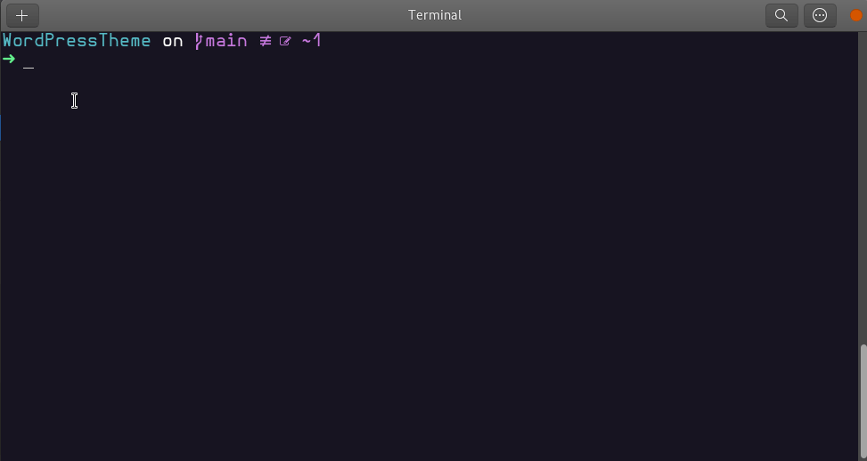
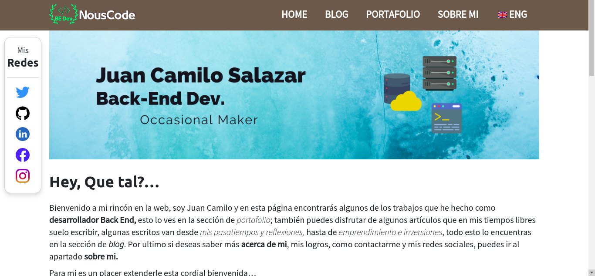

[](https://github.com/NousCode/personal-website)
[](https://github.com/NousCode/personal-website)


[](https://github.com/NousCode/personal-website)
[](https://github.com/NousCode/personal-website)
[](https://github.com/NousCode/personal-website/commits/main)


# 🌎️ Personal-Website
*It's the construction of a personal website, where it's possible to have a section page for your portfolio projects, write blog articles, and contact page.*

The project uses the WordPress CMS platform that brings a powerful way to built the web page, it lets customizing and create a theme using HTML, CSS, PHP and JavaScript. The cloud service of Digital Oceal will be the place for mount the web app.

## Table of Contents
1. [Configuration Environment](#-config-environment).
2. [Built with](#-built-with).
3. [Getting Started](#-getting-started).
4. [Installation](#-installation)


## 🎑 Config Environment
To run this project, you will need installed Docker in order to mount an image of WordPress, localwp, xampp, or install directly Worpress in your local machine. I'm going to use Docker for this documentation, but you can use any tool that you feel more confortable.

> ⚠️ The projec would be run, once you have configure the enviroment variables (**.env**)

## ✈️ Built with 
There are some technologies implemented to create this beatiful WordPress theme.

- PHP
- CSS
- JavaScript
- Bootstrap
- WordPress API/Framework
- SaSS
- MySQL

## 🧭 Getting Started
Fine, let's working on the tools you need it run this application in your computer.
### Prerequisites
Install in your computer [Docker](https://www.docker.com/get-started/)

If you correctly install Docker in your computer, you could verify the installation running the this command on your terminal `docker --version`. It will show you the last version installed in your computer.

## 🧳 Installation
Good job! In this section we are going to set up the WordPress theme.
### Instructions
1. Clone the repository in a local folder. 
	`git clone https://github.com/NousCode/personal-website.git`

2. Go into the project folder  
	`cd personal-website`

3. Create a file *.env*, and put this code. This file configure the docker variables.

> ⚠️ If you don't make this file, the Docker could not mount WordPress image.

```bash
#Example of .env file
WORDPRESS_PORT=own_port
DB_HOST=own_dbhost
DB_USER=own_dbuser
DB_PASSWORD=own_dbpassword
DB_NAME=own_dbname
```
4. Open a terminal and run this command, this will run docker system.  
	`docker compose up -d --build`



5. Now you can open your favorite browse, and introduce this URL *localhost:own_port*. You will see the WordPress's installation window, fill out the form and finish the WordPress installation.  

6. Go to the URL *localhost:own_port/wp-admin*, write the admin credentials and enter to the admin panel of WordPress.

7. In the appearance section of admin panel, you will see the theme calls **myspace**, select and activate it. Now your default WordPress theme will be of this project.

8. Congrats, the last thing is open your code editor and change things, styles, components or configure the theme as you want.

> 💡 All the PHP, JavaScript, CSS, HTML files are in `./project-directory/themes/myspace` directory.



## 🏖️ Deploy
The page is deployed in a droplet of Digital Ocean. If you go to this link [Juan's site](https://nouscode.net/), you could see the final result of this personal project.

---
[C10-Squad-Search-Engine] 💚 Platzi Master
